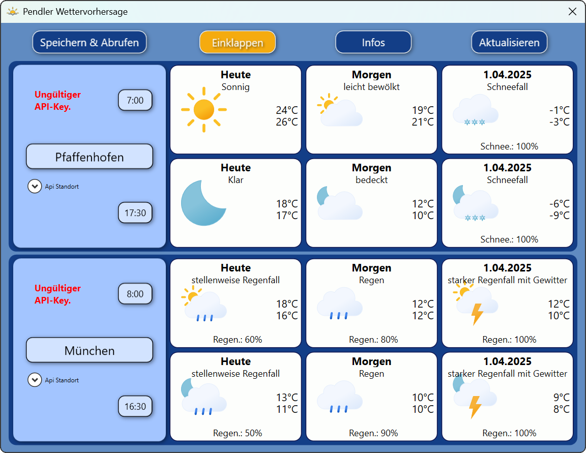
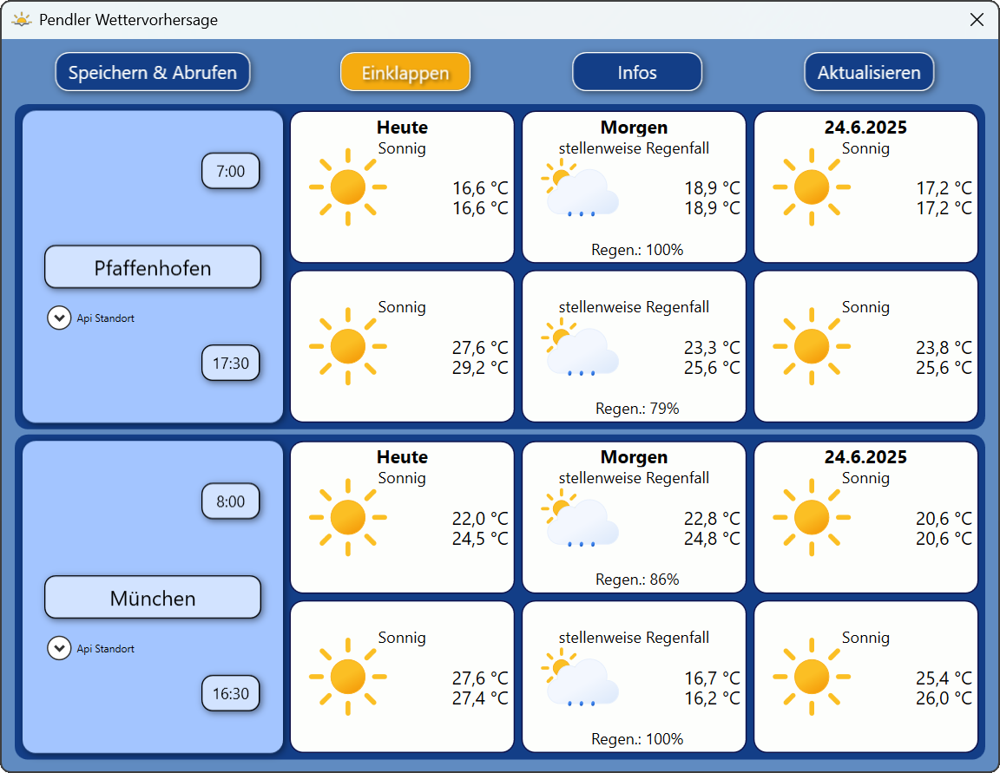
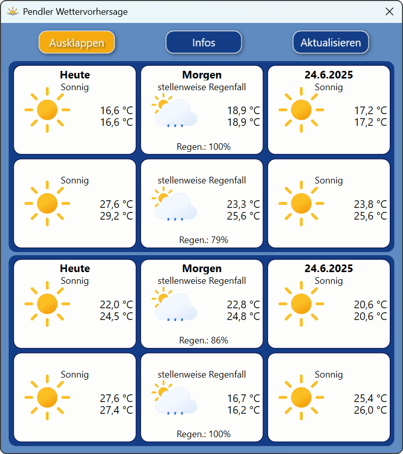
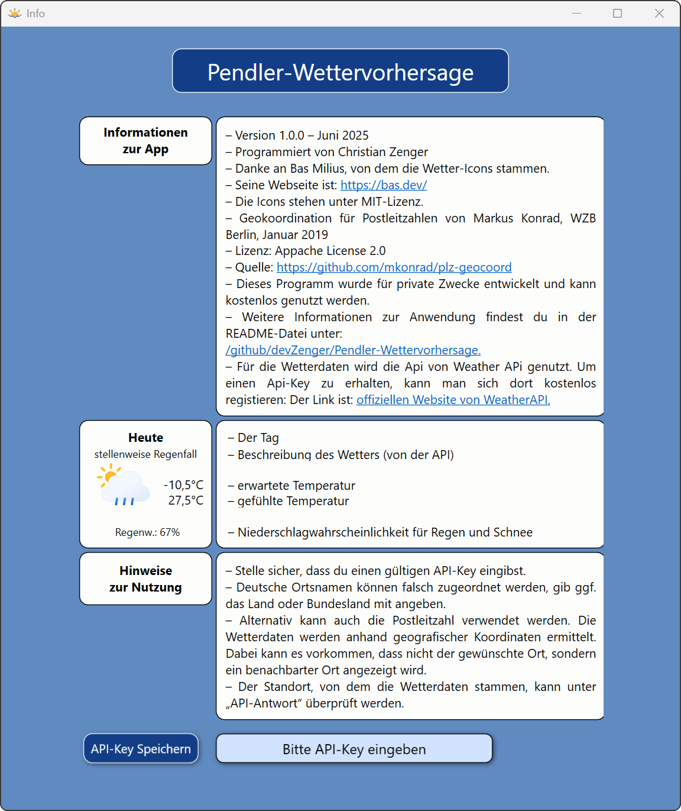

# Pendler-Wetterapp – Ein WPF-Project mit C# 

**Portable Desktop-App zur Wetteranzeige für Wohn- und Arbeitsort**, jeweils am Morgen und Abend – mit Temperatur, Regenwahrscheinlichkeit, Tag-/Nacht-Symbolik und zweitägiger Vorschau.
Entwickelt mit **C# / .NET 8.0 (WPF)**, umgesetzt im **MVVM-Muster** mit Datenbindung, SVG-Grafikdarstellung und API-Anbindung. Das Projekt dient der praxisnahen Anwendung moderner Softwarearchitektur in einem realistischen Anwendungsfall.


<div style="text-align: center;">
  <b><br>Pendler-Wetterapp: Ohne API-Key</b><br>
  <br>
<div style="display: inline-block; max-width: 80%; margin: 5px auto; text-align: left;">
    <p>
      <strong>Beschreibung:</strong> Diese Ansicht zeigt die Wetter-App im Zustand ohne gültigen API-Key. Es erscheint eine entsprechende Fehlermeldung, wie sie beim ersten Start der Anwendung angezeigt wird. Gleichzeitig sind verschiedene Wetter-Icons sichtbar, die beispielhaft die Darstellung unterschiedlicher Wetterlagen zeigen. Anhand der Icons lässt sich auch erkennen, ob es sich um Tag- oder Nachtzeiten handelt.
    </p>
  </div>
</div>

---

## Inhaltsverzeichnis

* [Verwendete Technologien](#verwendete-technologien)
* [Projektvorstellung](#projektvorstellung)
* [Technische Umsetzung & Herausforderungen](#technische-umsetzung--herausforderungen)
* [Programmstruktur](#programmstruktur)
* [Screenshots](#screenshots)
* [Installation & Quellcode](#installation--quellcode)
* [Lizenz](#lizenz)

---

## Verwendete Technologien

* **C# mit .NET 8.0 (WPF)**
* **MVVM**, Data Binding, Delegates
* **WeatherAPI.com** (Wetterdaten)
* **Newtonsoft.Json** (JSON-Verarbeitung)
* **SharpVectors** (SVG-Anzeige in WPF)
* **CsvHelper** (Einlesen von PLZ-Daten)
* **PlantUML** (Klassendiagramm)

---

## Projektvorstellung

Die Idee entstand während meines ersten Wetterprojekts in einem C#-Onlinekurs im Sommer 2024. In den Winterferien entwickelte ich daraus eine eigenständige, vollwertige Anwendung. Die App zeigt für zwei Orte – z. B. Zuhause und Arbeitsstelle – die Wetterlage zum Start und Ende des Tages an, jeweils mit Temperatur, Regenwahrscheinlichkeit und passendem Symbol.

Da die Wetterdaten stündlich vorliegen, wird für Zwischenzeiten per lineare Interpolation ein realistischer Wert berechnet. Das jeweilige Symbol richtet sich auch nach Tag-/Nachtzeit, wodurch man schnell erkennt, ob es zum Zeitpunkt dunkel ist – hilfreich besonders in den Übergangsmonaten.

Die App speichert die Eingaben in einer lokalen XML-Datei und ist portabel (keine Installation erforderlich). Als kleines Extra lässt sich die linke Seitenleiste einklappen, um das Fenster zu reduzieren.

---

### Technische Umsetzung & Herausforderungen

* **MVVM**: Das Projekt diente als Einstieg in das Model-View-ViewModel-Pattern. Es wurde eine klare Trennung von Logik und Darstellung umgesetzt.
* **Datenbindung**: Wetterdaten und UI-Elemente sind durch Data Binding dynamisch gekoppelt.
* **SVG-Integration**: Die Anzeige der Wetter-Icons über **SharpVectors** war anspruchsvoll, da SVG-Dateien in WPF nicht nativ unterstützt werden.
* **Portabilität**: Statt benutzergebundener `Settings.settings` wurde eine XML-Datei zur Speicherung im Anwendungsverzeichnis verwendet.
* **PLZ-Suche**: Mit einer eingebetteten `.csv`-Datei lassen sich auch Orte per Postleitzahl eingeben. Die Suche basiert auf Geokoordinaten.
* **Fehlerbehandlung**: Einfaches Fehlerhandling unterscheidet z. B. zwischen ungültigem API-Key und Netzwerkproblemen. Eingaben werden validiert.
---
### Fazit

Durch dieses Projekt habe ich gemerkt, dass das wirkliche Verinnerlichen von Programmierkenntnissen erst durch eigene praktische Anwendungen gelingt – ähnlich wie beim Sprachenlernen: Nur wer eine Sprache aktiv spricht, kann sie wirklich beherrschen.
Zudem konnte ich mein Verständnis für moderne C#-Entwicklung mit MVVM, Datenbindung und asynchroner API-Kommunikation deutlich vertiefen. Besonders lehrreich war der Umgang mit SVG-Grafiken in WPF sowie die strukturierte Verarbeitung komplexer JSON-Daten.

---

## Programmstruktur

````plaintext
Pendler-Wettervorhersage/
├── Commands/
├── Icons/
├── JsonDeserializeClasses/
├── Model/
├── Properties/
├── Resourcen/
├── Service/
├── ViewModel/
├── App.config
├── App.xaml
├── Assemblyinfo.cs
├── Info.xaml
├── Info.xaml.cs
├── MainWindow.xaml
├── MainWindow.xaml.cs
├── Pendler Wettervorhersage.csproj
├── SearchInputPanel.xaml
├── SearchInputPanel.xaml.cs
├── WeatherInfoPanelView.xaml
├── WeatherInfoPanelView.xaml.cs
└── README.md
````

---

## Screenshots

<div style="text-align: center;">
  <b><br>Pendler-Wetterapp: Beispiel</b><br>
  <br>
  <div style="display: inline-block; max-width: 80%; margin: 5px auto; text-align: left;">
    <p>
      <strong>Beschreibung:</strong> Zu sehen ist ein Beispiel der Wetterapp mit den Orten Pfaffenhofen und München sowie den zugehörigen Uhrzeiten. Die Wetterdaten werden übersichtlich dargestellt.
    </p>
  </div>
</div>

<div style="text-align: center;">
  <b><br>Pendler-Wetterapp: Eingeklappte Ansicht</b><br>
  <br>
  <div style="display: inline-block; max-width: 60%; margin: 5px auto; text-align: left;">
    <p>
      <strong>Beschreibung:</strong> In dieser Ansicht ist das Fenster eingeklappt. Orte und Uhrzeiten werden ausgeblendet, wodurch eine minimalistische Darstellung der Wetterdaten entsteht.
    </p>
  </div>
</div>

<div style="text-align: center;">
  <b><br>Pendler-Wetterapp: Informationsfenster</b><br>
  <br>
  <div style="display: inline-block; max-width: 80%; margin: 5px auto; text-align: left;">
    <p>
      <strong>Beschreibung:</strong> Im Informationsfenster finden sich Hinweise zur Nutzung der App, eine Beispielerklärung der Wetterdaten sowie Informationen zum API-Key, der hier angezeigt und gespeichert werden kann.
    </p>
  </div>
</div>


---

## Installation & Quellcode

#### Die App ist portabel und benötigt keine Installation:

1. ZIP herunterladen auf [Github](https://github.com/devZenger/Pendler-Wettervorhersage) und entpacken.
2. Unter Windows ausführen: `Pendler Wettervorhersage.exe`
3. Für die Nutzung den API-Key von [WeatherAPI.com](https://www.weatherapi.com/) eingeben und Speichern (Option unter Information).

> Hinweis: Ein API-Key von [WeatherAPI.com](https://www.weatherapi.com/signup.aspx) wird benötigt (kostenlos für Privatgebrauch).

#### QuellCode:
Wär interesse am Quellcode hat, kann das Repository mit folgenden Befehl klonen:
```bash
git clone https://github.com/devZenger/Pendler-Wettervorhersage
```


---

## Lizenz

Copyright (c) 2025 Christian Zenger  
GitHub: https://github.com/devZenger/Pendler-Wetterapp

Dieses Projekt wurde ausschließlich zu Lern- und Demonstrationszwecken entwickelt.
Die Nutzung des Quellcodes ist für den privaten, nicht-kommerziellen Gebrauch gestattet

Eine Weitergabe, Veränderung oder kommerzielle Nutzung ist nur mit ausdrücklicher Genehmigung erlaubt.

Bei Fragen oder Feedback freue ich mich über eine Nachricht.

### Drittanbieter-Komponeten

- **.NET 8.0 / C#** – [MIT License](https://github.com/dotnet/runtime/blob/main/LICENSE.TXT)
- **CsvHelper** – [Apache License, Version 2.0](https://joshclose.github.io/CsvHelper/)
- **Newtonsoft.Json** – [MIT License](https://github.com/JamesNK/Newtonsoft.Json?tab=MIT-1-ov-file#readme)
- **SharpVectors** – [BSD 3-Clause License](https://github.com/ElinamLLC/SharpVectors/blob/master/License.md)

### Quellen für Daten & Grafiken

- **Icons** von *Bas Milus*, lizenziert unter [MIT License](https://github.com/basmilius/weather-icons?tab=MIT-1-ov-file#readme)
- **PLZ-Geokoordinaten** von *Markus Konrad*, [Apache License 2.0](https://github.com/mkonrad/plz-geocoord)

